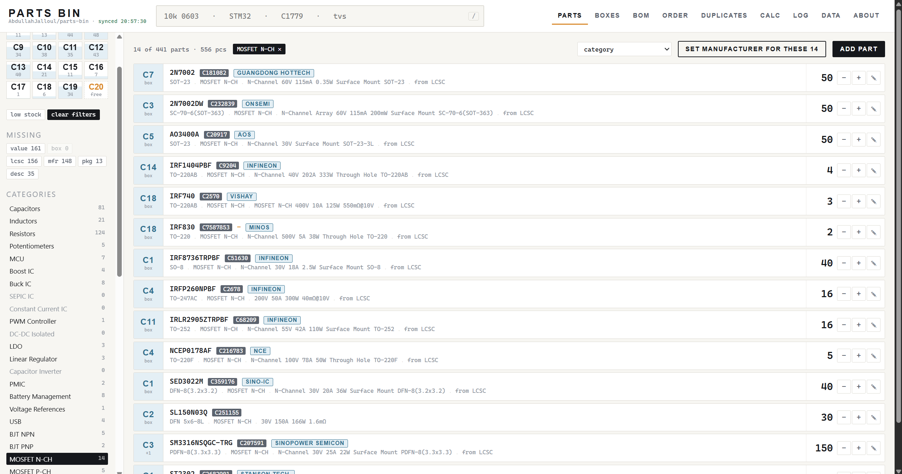
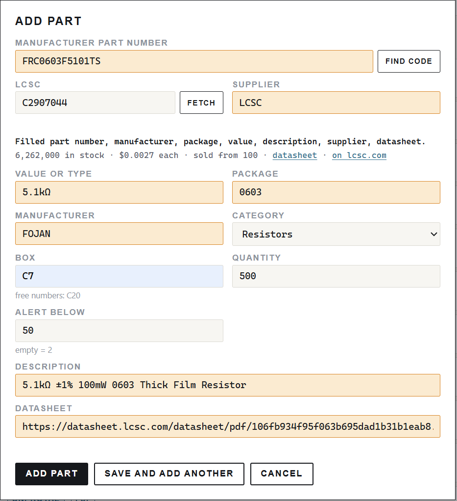
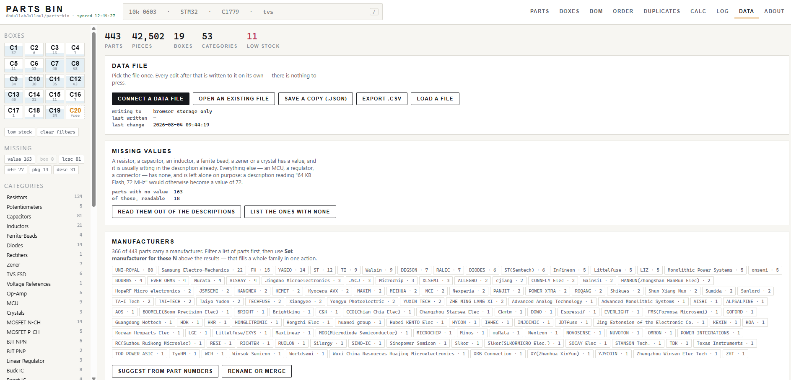
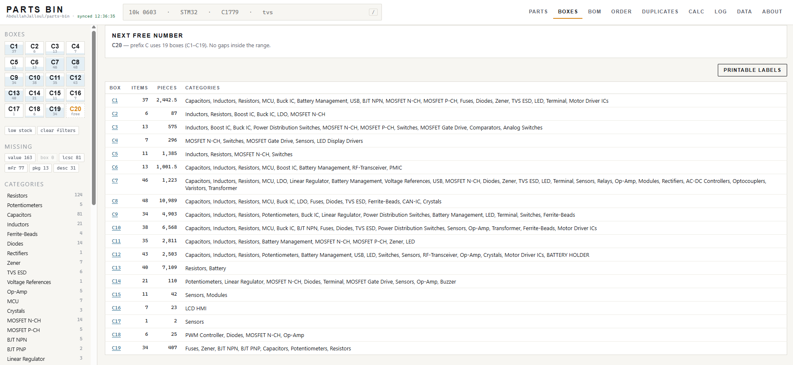
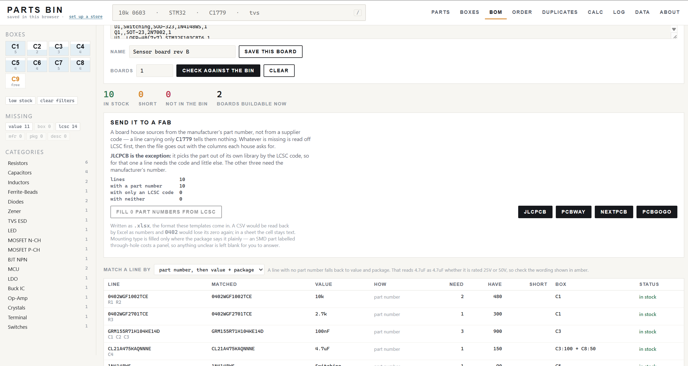
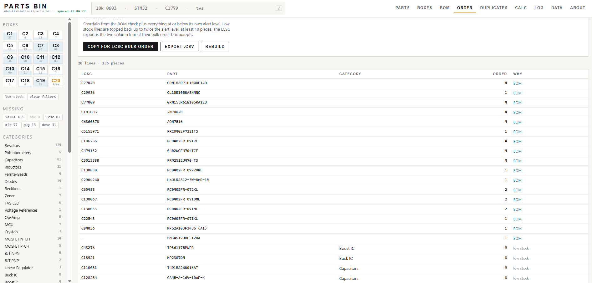
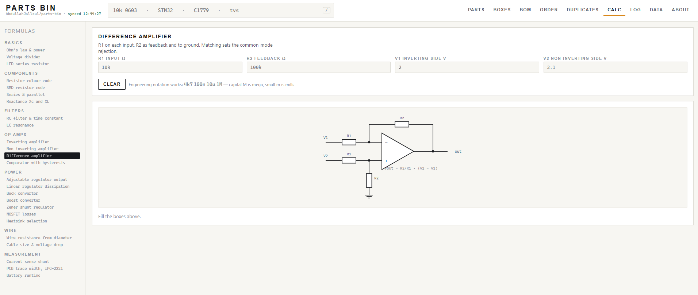
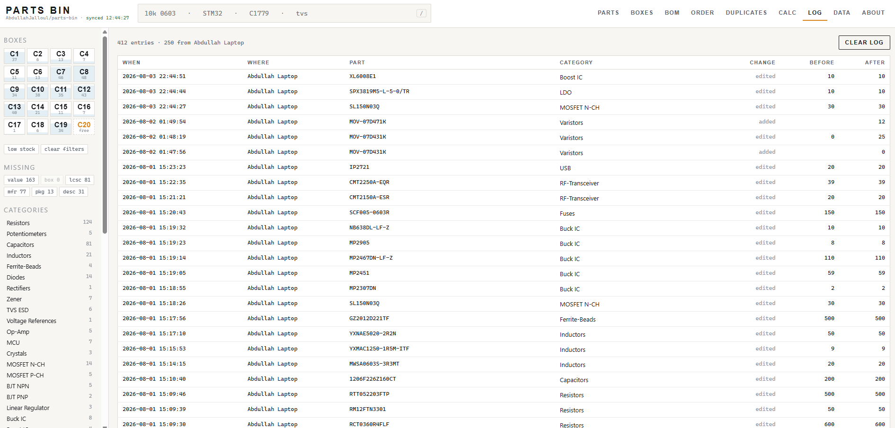

# Parts Bin

A component inventory for one workbench, in a single HTML file.

No server, no build step, no account, no dependencies. Open `inventory.html` in a browser and it
works — from a hard disk, from a USB stick, or from any address you serve it at. Type an LCSC part
code and the rest of the part fills itself in.

### ▶ [Try it in your browser](https://ajengineering.github.io/parts-bin-app/)

Nothing to install and nothing to sign up for. Press **Load the example bin** on the opening screen
and there is a made-up inventory to poke at — it goes no further than your browser, and your own
data is never involved.

[](https://ajengineering.github.io/parts-bin-app/)

**MIT licensed** — use it, change it, build on it, sell what you make with it. Just keep the
copyright notice with the copies you pass on.

---

## Why

A drawer of components stops being searchable somewhere around the two-hundredth part. You end up
buying a reel of 10 kΩ 0603 you already own, or discovering halfway through a build that the one
regulator you needed went into the last board.

Parts Bin keeps the count, remembers which drawer holds what, tells you whether a board is
buildable before you start it, and works out what to reorder — with the LCSC codes already in the
format their bulk order box accepts.

It is deliberately small and deliberately boring: one file of plain HTML, CSS and JavaScript, with
no framework and nothing to keep up to date.

## Quick start

To keep an inventory rather than just look at one, run your own copy — the hosted page is fine for
that too, but the file is yours and needs nothing from anybody.

1. Download [`inventory.html`](../../releases/latest) — or clone the repo and open the file.
2. Open it in a browser.
3. Go to **Data** and either:
   - press **Connect a data file** and pick a `.json` file on disk — every edit is written to it
     from then on, with nothing to press; or
   - set up [**Sync across computers**](#syncing-through-github) with a private GitHub repository,
     so every machine you open it on shows the same bin.
4. Add your first part, or paste a delivery into **Order → Receive** to book several in at once.

The page ships with no inventory in it. The program and your stock are separate files on purpose —
you can replace either one without touching the other. There is a small
[`example-components.json`](example-components.json) to try it with.

> **Browser note:** the "connect a file" option uses the File System Access API, which currently
> means a Chromium browser (Chrome, Edge, Brave, Opera). Everything else works anywhere; on Firefox
> and Safari, use **Save a copy** / **Load a file**, or the GitHub sync.

## What's in it

| View | What it does |
| --- | --- |
| **Parts** | Search, filter and count what is on the shelf |
| **Boxes** | Which drawer holds what, plus the next free box number |
| **BOM** | Paste a bill of materials and see what you can build right now |
| **Order** | What has run low, ready to paste into the LCSC bulk order box |
| **Duplicates** | The same part entered twice under two different names |
| **Calc** | Everyday bench formulas, each with its schematic drawn |
| **Log** | Every movement, stamped with the machine that made it |
| **Data** | The data file, GitHub sync, categories, and the LCSC settings |
| **About** | What this is, the licence, and where the source lives |

**Boxes → Printable labels** lays the drawers out as a printable sheet, one card per box with what
is inside it.

## Filling a part in from LCSC

Type an LCSC code (`C1779`) into the part editor and press **Fetch** — or just leave the field, and
it looks the part up on its own. The manufacturer part number, manufacturer, package, value,
description and category are read straight off LCSC.



*Amber marks what the lookup just filled in, datasheet included. The stock and the price on the
line underneath are not written into your bin — they are there to tell you whether the part is
still worth ordering.*

- **Only empty fields are filled.** Anything you have already written is left exactly as it is, and
  what LCSC would have said appears underneath as one click per value, so you take it only if you
  want it.
- **Values follow your own conventions,** not LCSC's running order — a capacitor comes back as
  `25V 4.7uF X5R ±10%`, an inductor as `8.5A 3.3uH ±20% 22mΩ`, a resistor as `10kΩ`. Parts that do
  not have a value in the usual sense — an MCU, a regulator, a MOSFET — are left blank, on purpose.
- **Categories are matched onto the ones you already have.** A new category is never invented for
  you; an N-channel MOSFET lands in your `MOSFET N-CH` shelf if you have one, and nowhere if you
  don't.

### Finding the code from a part number

Plenty of parts were entered with only a manufacturer part number. **Find code** — the button beside
that field in the screenshot above — searches LCSC for it and offers what comes back.

The search is treated as a guess, because it is one. LCSC answers a part number it does not carry
with near neighbours: searching `0603SAF8204T5E` returns `0603WAF8204T5E`, a different tolerance
and the wrong part to write into a bin. So every candidate is read back through the part endpoint
and its real part number compared with the one asked for. Exact matches and near misses are listed
separately, nothing is written, and you pick.

### Catching up parts you already entered



**Data → Filling a part in from LCSC** counts how many parts carry an LCSC code but still have a
field blank, and **Read N parts off LCSC** goes through them in one pass, with a progress count
that can be stopped part-way.

Nothing is written until you have seen the list: the run only *proposes* fills, you look at the
table, and **Fill in N parts** applies them — with a single **Undo** that puts back exactly the
fields it changed. A part with no value is not treated as missing, since an MCU or a MOSFET has
none and never will.

### About the relay

LCSC serves this data to anyone but does not send an `Access-Control-Allow-Origin` header, so a
browser will not hand the reply to a page at another address. The request therefore travels through
a relay. That is already arranged and needs nothing from you — **Data → Test it on C1779** names
whichever relay answered. A relay only ever sees the part code being looked up.

The [hosted demo](https://ajengineering.github.io/parts-bin-app/) uses a relay of the project's
own, so that trying it works first time. A copy you download falls back to free public relays,
which are slower and go quiet now and then.

### A relay of your own

If you are going to rely on this, five minutes and a free Cloudflare account gets you one that is
never busy — and it unlocks the better part-number search, because it can forward a `POST`.

Make a Worker at **Workers & Pages → Create → Create Worker**, paste this, deploy:

```js
export default {
  async fetch(req) {
    const cors = {
      "Access-Control-Allow-Origin": "*",
      "Access-Control-Allow-Methods": "GET,POST,OPTIONS",
      "Access-Control-Allow-Headers": "Content-Type,Accept",
      "Access-Control-Max-Age": "86400"
    };
    if (req.method === "OPTIONS") return new Response(null, { headers: cors });

    const target = new URL(req.url).searchParams.get("url");
    if (!target) return new Response("missing url", { status: 400, headers: cors });

    // Only these hosts. An open proxy is found and abused within days.
    let host;
    try { host = new URL(target).hostname; }
    catch { return new Response("bad url", { status: 400, headers: cors }); }
    if (!["wmsc.lcsc.com", "www.lcsc.com", "jlcpcb.com"].includes(host))
      return new Response("host not allowed", { status: 403, headers: cors });

    const init = {
      method: req.method,
      headers: { "User-Agent": "Mozilla/5.0", "Accept": "application/json",
                 "Referer": "https://www.lcsc.com/" }
    };
    if (req.method === "POST") {
      init.body = await req.text();
      init.headers["Content-Type"] = "application/json";
    }
    const r = await fetch(target, init);
    return new Response(await r.arrayBuffer(), {
      status: r.status,
      headers: { ...cors, "Content-Type": r.headers.get("content-type") || "application/json" }
    });
  }
};
```

Then put its address into **Data → If the lookup ever stops working**, with `{url}` on the end:

```
https://your-worker.your-name.workers.dev/?url={url}
```

**Test it on C1779** should answer *“answered by your relay”*. The free tier is 100,000 requests a
day, which no bench will come close to.

> **Why part-number search prefers JLCPCB.** LCSC have no search endpoint open to anyone else, so
> the only way in is to render their search page and read the links off it — and a page assembled
> in the browser is a poor thing to scrape, since the relay hands back whatever it looked like when
> it stopped waiting. JLCPCB index the same catalogue and answer in JSON, which has no such failure
> mode. When a search does come back empty the message says the page may have been read too early,
> rather than claiming the part does not exist. Entering the code directly always works.

## Boxes and drawers



The wall down the side is the drawers, sized by how full they are. Clicking one filters the list to
it; the dashed tile at the end is the first number not in use.

### Adding a whole drawer at once

Click that dashed **free** tile. The part editor opens with the box number already filled in, and
**Save and add another** keeps the box and the category while clearing the rest — so a new drawer
can be filled without the form closing once. Combined with the LCSC lookup, adding a part is:
paste code → **Fetch** → **Save and add another**.

## Checking a bill of materials



Paste a BOM straight out of KiCad, Altium or a spreadsheet — CSV, semicolons or tabs. A header row
is detected on its own. It tells you what is in stock, what is short, what is not in the bin at
all, and how many boards you could build right now.

### How a line is matched

A part number names one part. A value does not: the matcher reduces `25V 4.7uF X5R ±10%` to a
single magnitude before comparing, so the voltage, the tolerance and the dielectric fall out on the
way and a 50V ±20% part answers to a 25V ±10% line. On a decoupling cap that is nothing; on a
divider setting a feedback voltage it is the wrong part. So it is a choice, made above the results:

| Mode | What it does |
| --- | --- |
| **part number, then value + package** | Falls back to value and package when a line has no number |
| **part number only** | A line matches its own part number or LCSC code, or not at all — nothing is inferred from the shelf |

Where a match is still made on value, the matched part's own wording is shown in amber, so a
mismatch is visible rather than silent. And where several parts share a value and the line names no
footprint, nothing is matched at all — a bin holding 1kΩ in 0603, 1206 and 0805 would otherwise
hand back whichever was entered first, and the exported file would carry that part's number and
that footprint.

### Sending it to a board house

**Send it to a fab** exports the checked BOM for **JLCPCB**, **PCBWay**, **NextPCB** or **PCBGOGO**.
The column headings are taken from each house's own template, so the file goes up without being
rearranged first — NextPCB stars its required columns, PCBGOGO leads with the quantity and asks for
a buying link, which is filled with the part's LCSC page.

JLCPCB is the exception and the easiest of the four: it wants `Comment`, `Designator`, `Footprint`
and `LCSC Part #`, and picks the part out of its own library by that code — which is the one number
every part in this bin already carries. The other three source from the manufacturer's part number,
so for those a line holding only a supplier code has to be filled in first.

Files are written as real **`.xlsx`** workbooks, not CSV. A CSV is read back by Excel as numbers,
and `0402` loses its leading zero the moment the fab opens it; in a sheet the cell stays text.

A fab sources from the manufacturer's part number, not a supplier code, so a line carrying only
`C1779` is useless to them. **Fill N part numbers from LCSC** reads the missing ones off LCSC and
writes them onto the lines. Lines that matched something already on your shelf take the
manufacturer and description from there. Anything still without a number — a connector LCSC has
never heard of, a part from another supplier — gets a box under the buttons to type it into, and it
goes into the file.

Mounting type is only written where the package says so plainly. `TO-220` is through-hole and
`TO-252` is not; `DO-41` is through-hole and `DO-214` is not; `Plugin` is LCSC's word for
through-hole. Anything that does not say outright is left blank rather than guessed, because an SMD
part labelled through-hole costs a panel.

Footprints keep their leading zero. A spreadsheet treats `0402` as a number and hands back `402`,
which tells a fab nothing — so a three-digit footprint that is really a chip size is padded back
out, whether it arrives in a pasted BOM, gets typed into the editor, or is already sitting in your
data file.

## Reordering



**Order** gathers the shortfalls from the last BOM run and everything at or below its own alert
level. **Copy for LCSC bulk order** puts it on the clipboard in the two-column form their bulk box
accepts, so reordering is a paste. Lines with no LCSC code are counted separately, since those have
to be ordered by part number.

**Order → Receive** takes the delivery note back: paste the supplier's CSV, check it, and book the
lot in at once. Parts already on the shelf have their quantity added; anything new is created and
only needs a box.

## Calculators



Twenty-five bench formulas — dividers, regulators, MOSFET losses, wire gauge, RC and LC, resistor
colour bands, SMD code decoding — each drawn as a schematic that updates as you type, so you can
see what the numbers are describing.

## The log



Every add, edit, deletion and stock change, stamped with the machine that made it. Name each
machine under **Data → This computer**, and the log tells you which bench did what.

## Search

The field at the top filters as you type. Several words all have to match, in any field.

| Query | Meaning |
| --- | --- |
| `10k 0603` | both words, any field |
| `mfr:murata` | one field only — `mfr`, `box`, `cat`, `pkg`, `lcsc`, `mpn`, `val`, `desc`, `src` |
| `qty<10` | compare stock: `<` `>` `<=` `>=` `=` |
| `no:value` | the field is empty — also `no:box`, `no:lcsc`, `no:mfr`, `no:pkg`, `no:min` |
| `has:mfr` | the field is filled in |
| `cat:MCU qty<5` | mix them freely |
| `/` | jump to the search field from anywhere |

## Box notation

One box: `C7`. Two boxes with the quantity shared equally: `C1 + C6`. An exact split:
`C1:25 + C6:20`. The box view uses the same rules.

## Categories

Under **Data → Categories** a category can be dragged to where it belongs, nudged a step with the
arrows, or the whole list ordered in one click — alphabetically, or fullest first. Both are
undoable.

That order is the one used everywhere else: the rail down the side, the dropdown in the part
editor, and the parts list when it is sorted by category. Put the shelves you reach for most at the
top; a bench is not usually arranged alphabetically.

## Syncing through GitHub

If you use more than one machine — a bench PC and a laptop, say — a private GitHub repository can
hold the inventory file and every machine will show the same bin. Every save is an ordinary commit,
so you get the full history for free, and GitHub refuses a push that would overwrite a newer one.

### 1. Make a private repository for your data

This is **not** the repository the program lives in — it holds only your `components.json`. Create
an empty private repo, for example `yourname/my-parts`. You do not need to add any files to it;
the first push creates the file.

### 2. Make a fine-grained access token

On GitHub: **Settings → Developer settings → Personal access tokens → Fine-grained tokens →
Generate new token**.

| Field | Set it to |
| --- | --- |
| Repository access | **Only select repositories** → the one you just made |
| Permissions → Repository → **Contents** | **Read and write** |
| Expiration | your choice — you will need a new token when it lapses |

Contents is the only permission needed. Generate it and copy the token; GitHub shows it once.

### 3. Point the app at it

Open **Data → Sync across computers** and fill in:

| Field | Example |
| --- | --- |
| Repository | `yourname/my-parts` |
| File path | `components.json` |
| Branch | `main` |
| Access token | the token you just copied |

Then press **Pull from GitHub** once. A machine has to pull before it is allowed to push — that is
what stops a fresh browser with an empty bin from wiping the real one. If the file does not exist
yet you will be told so; press **Push to GitHub** to create it.

Tick **sync automatically** and every later change is pushed on its own.

### On the second machine

Open the same `inventory.html`, enter the same repository, path, branch and a token, and press
**Pull from GitHub**. The bin appears. From then on both machines stay level.

### How conflicts are handled

Parts follow the last machine that pushed. The movement log is *merged* rather than replaced, so
entries made on another computer are never lost. If someone else pushed while your tab sat idle,
your push is refused and you are told to pull first — **Force push** is there if you are certain
yours is the copy to keep.

## Your data

The parts live in a `.json` file you control — on your disk, or in a private repository of your
own. Nothing is uploaded anywhere else and there is no analytics of any kind. The only outbound
request the page ever makes is the LCSC lookup, and only when you ask for it.

The access token is kept in that browser's local storage and is never written into the inventory
file, so it cannot leak through a synced or exported copy. Anyone using that computer profile can
read it, though — scope it to the one repository, and revoke it if the machine changes hands.

## Contributing

Issues and pull requests are welcome. It is one file — open it in an editor and the whole program
is in front of you, with the reasoning written in the comments.

## Licence

[MIT](LICENSE) © Abdullah Jalloul

Part data is read from [LCSC](https://www.lcsc.com/), who publish it. This project is not
affiliated with or endorsed by LCSC.
